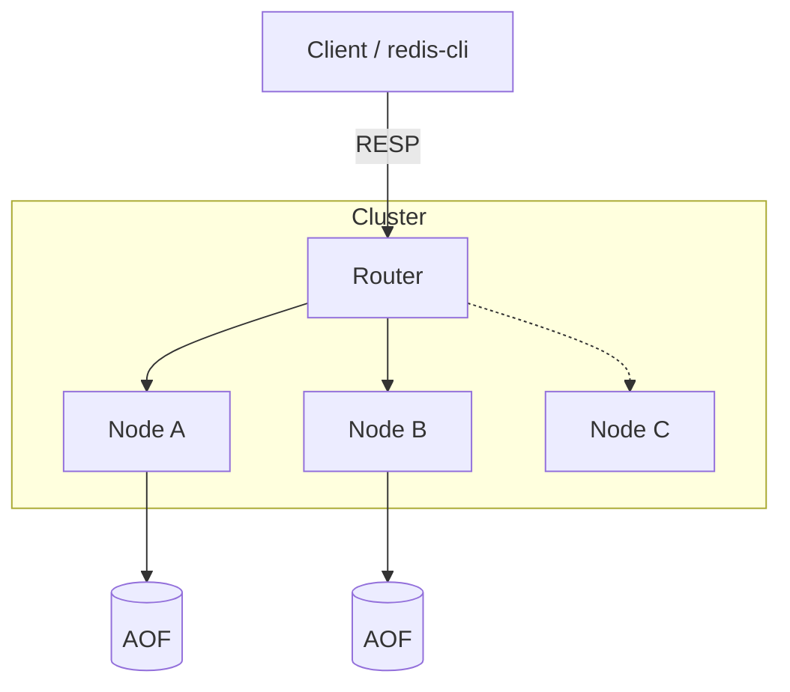

# Redis-Lite 🚀

A high-performance, distributed, and fault-tolerant Key-Value database engine built from scratch in bare-metal C++17. 

This project is a functional Redis-like system that implements the RESP protocol, enabling compatibility with standard Redis clients.

---

## ✨ Core Features

- **RESP Protocol Support** – Works with `redis-cli` and Redis-compatible clients  
- **Custom LRU Cache** – O(1) eviction using hashmap + doubly linked list  
- **TTL Expiration** – Time-based key expiry  
- **High-Performance Networking** – Async event-driven server using `epoll`  
- **AOF Persistence** – Append-only file for durability  
- **Consistent Hashing** – Load distribution across nodes  
- **Service Discovery** – Heartbeats + dynamic node management  
- **Unit Testing** – Google Test based test suite  

---

## 🧠 Architecture



## ⚡ Performance
- ~10K+ req/sec (in-memory)
- ~1.5K req/sec (disk-bound)
- Handles concurrent connections efficiently
- Zero dropped connections under stress tests

## 🚀 Getting Started
### Option 1 — Docker

```bash
docker build -t redis-lite .
docker run -d -p 6379:6379 redis-lite
```

### Option 2 — Local Build
```bash
mkdir build
cd build
cmake ..
cmake --build .
```

### Run:
```bash
./redis-server
Run Tests
./run_tests
```

## 🔌 Usage
```bash
redis-cli -p 6379
```
Example:
```bash
SET user:1 "Alice"
GET user:1
```

## 🛠️ Supported Commands
Command	Description
PING	Health check
SET	Store value
GET	Retrieve value
SETEX	Store with TTL
LPUSH	Insert into list
LRANGE	Read list

## 📁 Project Structure
redis-lite/
├── include/
│   ├── network/
│   ├── storage/
│   └── utils/
├── src/
│   ├── network/
│   ├── storage/
│   ├── utils/
│   └── main.cpp
├── tests/
├── build/
├── CMakeLists.txt
├── Dockerfile
└── README.md

## 🧪 Testing

Uses Google Test:

./run_tests

Covers:

LRU eviction
TTL expiration
Hash ring distribution
Store logic

## 🧱 Tech Stack
C++17
CMake
epoll (Linux)
Docker
Google Test